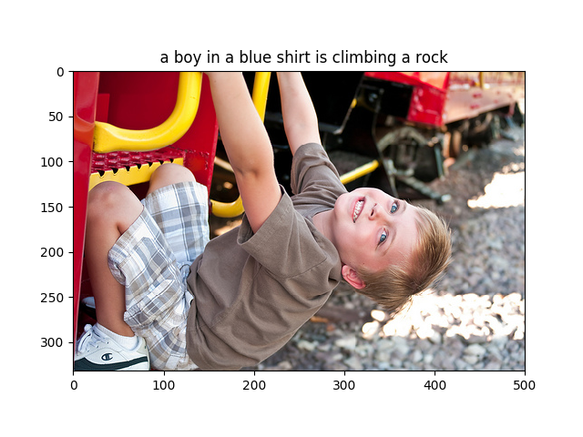
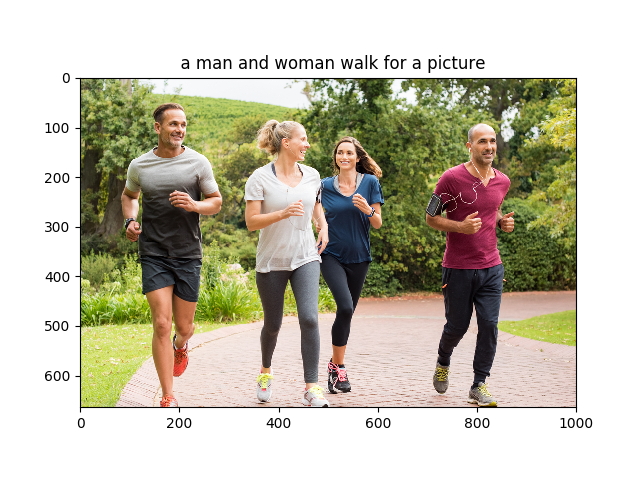
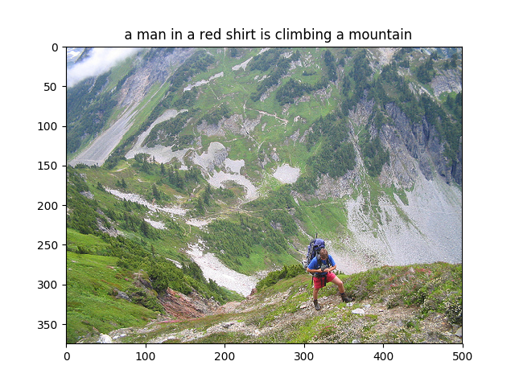
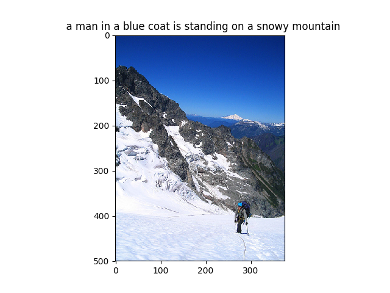
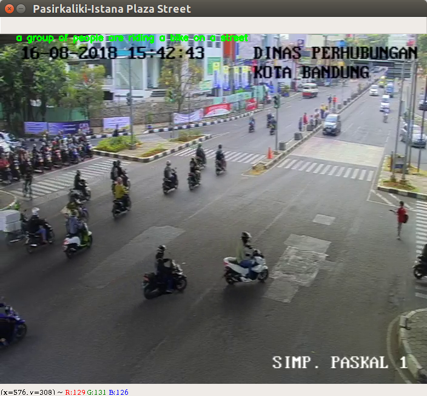

# Amazing Image Captioning

## Prerequisites
This tutorial only applies to UNIX like systems. If your system not an UNIX type, please search the tutorial based on your system.

### What you need to have
* Miniconda with Python 3
* [Docker](https://docs.docker.com/install/)


### Install Miniconda with Python 3
```
wget https://repo.continuum.io/miniconda/Miniconda3-latest-Linux-x86_64.sh
bash Miniconda3-latest-Linux-x86_64.sh
```

### Create an environment and install the library
```
conda env create
source activate image-captioning
```

## Download the Dataset
### Create dataset folder
```
mkdir dataset
cd dataset
```

### Flickr8k Dataset
M. Hodosh, P. Young and J. Hockenmaier (2013) "Framing Image Description as a Ranking Task: Data, Models and Evaluation Metrics", Journal of Artifical Intellegence Research, Volume 47, pages 853-899
http://www.jair.org/papers/paper3994.html

#### Download Images and Caption
```
wget http://nlp.cs.illinois.edu/HockenmaierGroup/Framing_Image_Description/Flickr8k_Dataset.zip
wget http://nlp.cs.illinois.edu/HockenmaierGroup/Framing_Image_Description/Flickr8k_text.zip
```

#### Unzip
```
unzip Flickr8k_Dataset.zip
unzip Flickr8k_text.zip
```

## Tutorial
### Train the model
```
python -m src.train -m <your-model-type>
```
##### Model type:
1: train using image caption sentence modeler<br>
2: train using image caption single word modeler

### Serving the model
```
python -m src.train -m <your-model-type>
```
##### Model type:
1: serving using image caption sentence modeler<br>
2: serving using image caption single word modeler

### Predict Image
```
python -m src.predict -m <your-model-type> -p <your-image-path> [OPTION]
```

##### Model type
1: predict using image caption sentece modeler<br>
2: predict using image caption single word modeler

##### Option
* --show-image : show captioned image with matplotlib

### Predict Video frame by frame
```
python -m src.run_video <your-video-path>
```
If video path is empty, it will use your webcam as video stream

### Predict CCTV frame by frame
```
python -m src.run_cctv
```

## Results
### Image Captioning





### CCTV Captioning


## Authors
* **Aditya Alif Nugraha** - [Aditya Alif Nugraha](https://github.com/adityaalifn)
* **Bramantyo Ardian**

## Resources
* [Convolutional Neural Network - deeplearning.ai](https://www.youtube.com/playlist?list=PLkDaE6sCZn6Gl29AoE31iwdVwSG-KnDzF)
* [Convolutional Neural Network - Stanford University](https://www.youtube.com/playlist?list=PL3FW7Lu3i5JvHM8ljYj-zLfQRF3EO8sYv)
